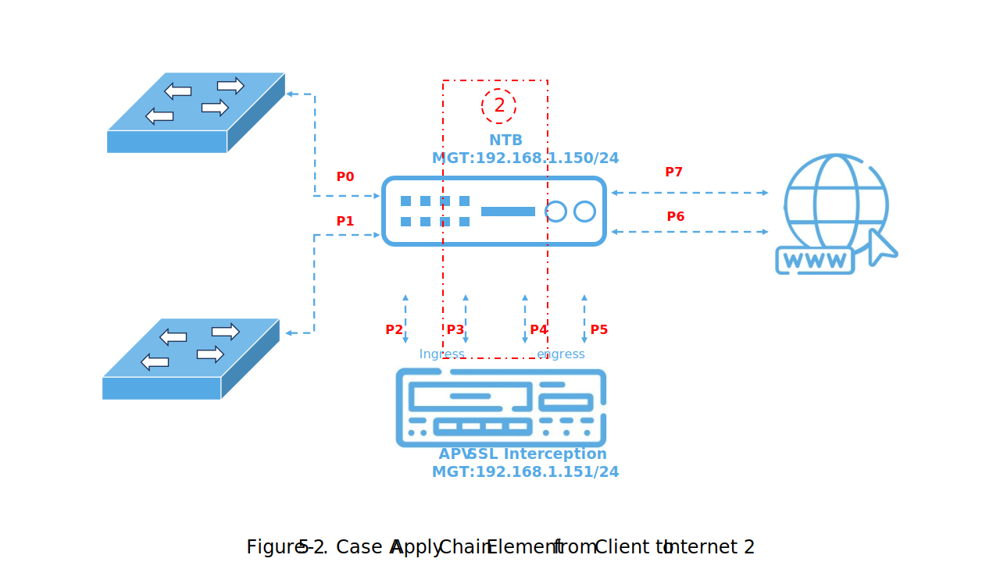
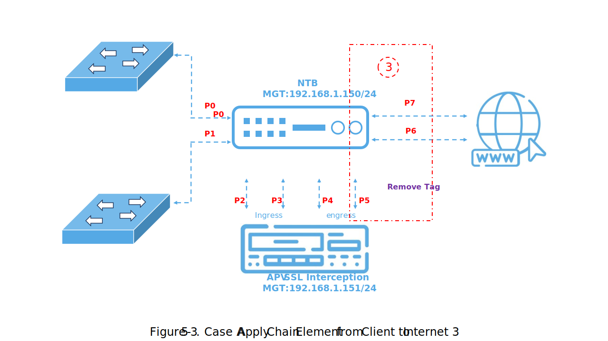
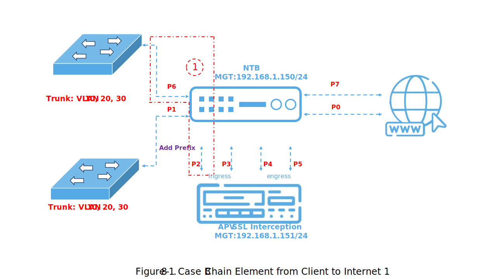
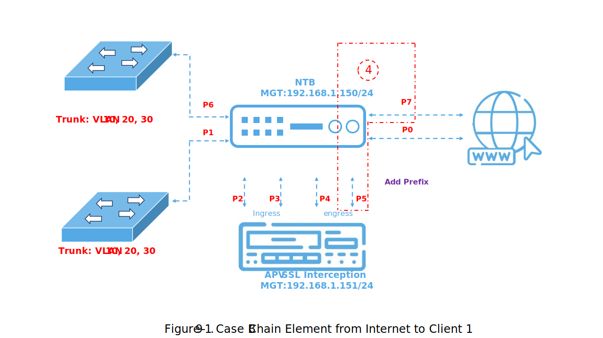
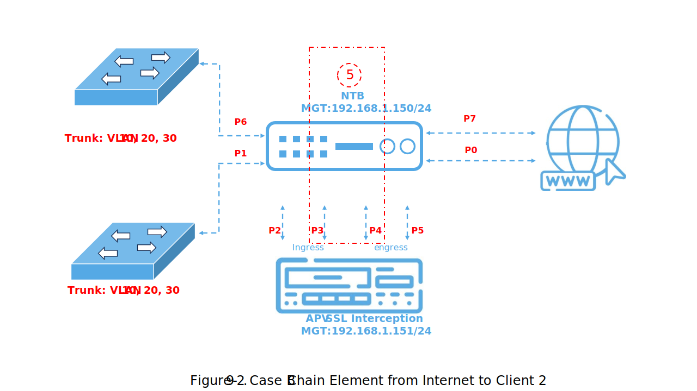

[PDF](https://drive.google.com/file/d/1hzA-XH0U7FZxPFe8bjIiI0OH4d_Njs6w/view?usp=sharing)
<center><font size="5"><strong>Table of Content</strong></font></center>


[TOC]


# Introduction

In the ever-evolving landscape of network management and security, the Network Traffic Broker (NTB) emerges as a valuable asset, transforming the way organizations enhance the security of their networks and share resources among multiple security devices. The concept of sharing security functions across various devices has become increasingly crucial in today's complex network environments. NTB plays a pivotal role in enabling devices like Intrusion Prevention Systems (IPS), Firewalls, Anti-Virus walls, and more to efficiently collaborate and share responsibilities for tasks such as traffic analysis, threat detection, and data filtering across multiple network links.

This strategic shift not only elevates the overall security posture of network configurations but also empowers organizations to make the most of their existing equipment and resources. In an era of ever-evolving cyber threats, understanding how to harness the potential of NTB for sharing security functions among multiple links is paramount for network professionals seeking to fortify their network defenses.

Setting up the Network Traffic Broker (NTB) for multi-link security device sharing is a multifaceted endeavor. In this training guide, we will focus on one of the primary methods of configuration: using the user-friendly Web GUI interface. Although NTB can also be configured via the console interface, our primary aim is to harness the web-based interface to facilitate seamless resource sharing and enhanced security across multiple network links. This guide will provide a step-by-step walkthrough, offering valuable insights into the process of configuring the NTB for multi-link security device sharing. By the end of this tutorial, you will possess the knowledge and skills needed to leverage NTB's potential, allowing you to optimize resource allocation and fortify your network's defenses across various links.


# Web UI

To access the Web UI of any NTB model, you can connect to the MGMT port. The default IP address for the NTB is set to 192.168.1.150. When initially accessing the Web UI, you can utilize the default login credentials, where the username is "array," and the password is "admin," as illustrated in Figure 1. Once logged in, you will gain entry to the main page (depicted in Figure 2). From this main page, navigate to the "NTB XML" tab. This section allows users to harness the full capabilities of the NTB by utilizing XML tags for configuration and management.  

<center></center>
In this training document, once you access the NTB XML interface, you will encounter file tabs, file action buttons, and file edit windows, as illustrated in Figure 3. Let's explore the functions of each element in detail :

1. ***File Tabs:*** The file tabs display the available files for configuring NTB data task rules. Currently, the system supports two types of files: JavaScript and XML. The active file's tab will be highlighted in white, while the inactive ones will appear in gray. You can also make modifications to the content of these files through the file edit windows . 

2. ***File Action Buttons:*** There are five types of action buttons: "Format," "Reset," "Submit," "Save," and "Load."

   * The "Format" button checks whether the current active file complies with the proper XML format.
   * Clicking "Reset" reverts the current active file to its last submitted state, discarding any unsaved changes.
   * The "Submit" button for JavaScript files saves the current status of the JavaScript file. However, when dealing with XML files, clicking "Submit" will adjust the NTB's settings accordingly.
   * The "Save" and "Load" buttons are used for saving and loading the current XML file to and from disk space. 
  
3. ***File Edit Windows:*** This window is designed for modifying the content of XML or JavaScript files. It's worth noting that its capabilities are somewhat rudimentary, making it less suitable for editing large volumes of content. For more extensive edits, it's recommended to use external software and subsequently copy-paste the revised content into this window for submission .   


# XML Element

 The NTB utilizes XML scripts to establish control over data flow and perform packet engineering. XML files employ various elements to achieve distinct effects on the NTB. A comprehensive list of all XML elements can be found on the website [https://arraynetworks.gitbook.io/array-xml/](https://arraynetworks.gitbook.io/array-xml/). In this training document, we will specifically introduce the elements that will be utilized.


1. ***Element <run>:*** This should be the first element and encapsulate the entire document. Only elements inside the <run> element will be considered legal use of the XML elements.

2. ***Element <filter>:*** This element defines the filter rules to be employed in the XML script. Within this element, you have the option to assign attributes such as 'id' and 'name' to identify the filter for future reference. Additionally, other attributes like 'sessionBase' and 'matchedlog' can be used to control the filter's behavior. Furthermore, there are three types of elements available to establish filter rules: <find>, <and>, and <or>.  

   * Element <find>: This element defines the attribute used to distinguish the desired packet from the rest. Available attributes for selection include, but are not limited to, vlan.id, ip.addr, tcp.port, and more.
   * Elements <and> and <or>: These two elements define the relationships between different <find> elements. When various <find> elements are enclosed within <or> </or> tags, it will only be necessary to satisfy one condition. In contrast, for <and> </and>, it will be necessary to satisfy all find conditions.  
  
3. Element <output>: This element defines various actions and packet manipulations that can be performed when an internet packet exits a port. By using the <port> element to specify the exit port, you can then utilize various elements for packet engineering, such as <strip> to remove packet information, <Q> to add VLAN ID, and many other tags.  

4. Element <chain>: This element serves to consolidate all the elements together. It utilizes the <in> element to specify the input port, <fid> to identify the filter used, <next> element is used to specify the path a packet is going to take after being filtered, and <out> elements to define the output port and any actions to be taken at the output.

For comprehensive documentation and detailed guidance on how to utilize each element, as well as explore all available attributes, please refer to [https://arraynetworks.gitbook.io/array-xml/](https://arraynetworks.gitbook.io/array-xml/).


# Training Case
## Case A

<center></center>

In Case A, our objective is to offload SSL interception for multiple links, as depicted in Figure 4. To initiate this process, we must capture all HTTPS traffic, achieved by filtering all traffic destined for TCP port 443. It's important to note that this traffic can originate from either port 0 or port 1. After undergoing SSL interception, it's crucial to keep these traffic streams separate. Traffic from port 0 should exit via port 7, while traffic from port 1 should exit through port 6. To achieve this separation, we add a VLAN 100 tag to all traffic from port 0 before SSL interception, and remove it afterward. Similarly, for port 1 traffic, we use a VLAN 200 tag. These VLAN tags enable us to employ filters for the separation of port 0 and port 1 traffic.

* Traffic to/from TCP port 443 requires SSL interception
* For traffic entering through Port 0, it should exit through Port 7, and vice versa
* For traffic entering through Port 1, it should exit through Port 6, and vice versa

### Case A Develop filter

Base on above criteria we are create the following <filter> and <output> element :

``````XML
<!--  to catch destination port 443 from forward packet -->     
<filter id="10" name="forward to SSLi for specific port" sessionBase="no">
        <or>
            <find name="tcp.dstport" relation="==" content="443"/>
        </or>
    </filter>

<!--  to catch source port 443 from return packet -->
<filter id="11" name="return to SSLi for specific port" sessionBase="no">
      <or>
          <find name="tcp.srcport" relation="==" content="443"/>
      </or>
</filter>
<!--  to catch vlan ID for return to source/destination physical port -->
<!--  path 1: vlan 100 , path 2: vlan 200 -->
<filter id="12" name="Path 1 Vlan Tag 100" sessionBase="no">
     <or>
        <find name="vlan.id" relation="==" content="100"/>
     </or>
</filter>

<!-- Add Tag-->
<output id="11">
        <port>P2</port>
        <Q>100</Q>
    </output>
 <output id="12">
        <port>P2</port>
        <Q>200</Q>
    </output>
<output id="21">
        <port>P5</port>
        <Q>100</Q>
 </output>
<output id="22">
        <port>P5</port>
        <Q>200</Q>
 </output>

<!-- Remove Tage -->
<output id="31">
        <port>P7</port>
        <stripping>vlan</stripping>
    </output>
 <output id="32">
        <port>P6</port>
        <stripping>vlan</stripping>
    </output>
</output>
    <output id="41">
        <port>P0</port>
        <stripping>vlan</stripping>
    </output>
    <output id="42">
        <port>P1</port>
        <stripping>vlan</stripping>
    </output>

``````
<div style="page-break-before:always"></div>
### Case A Apply Chain Element from client to internet

<center></center>
<center></center>
<center></center>

After the <filter> and <output> element was created, we will start create <chain> element from client to internet.  

``````XML
<!-- Path 1  forward-->
<chain id="101" name="forward client to Server side or SSLi Ingress">
      <in>P0</in>
      <fid>F10</fid>
      <out>O11</out>
      <next type="notmatch">
          <out>P7</out>
      </next>
</chain> 
<chain id="102">
        <in>P3</in>
        <out>P4</out>
</chain>
<chain id="103">
        <in>P5</in>
        <fid>F12</fid>
        <out>O31</out>
        <next type="notmatch">
            <out>O32</out>
        </next>
</chain>
 <!-- Path 2  forward-->
<chain id="201" name="Path 2 forward client to Server side or SSLi Ingress">
        <in>P1</in>
        <fid>F10</fid>
        <out>O12</out>
        <next type="notmatch">
            <out>P6</out>
        </next>
</chain>

``````
<div style="page-break-before:always"></div>
### Case A Apply Chain Element from internet to client

<center></center>
<center></center>
<center></center>

Next, we will create the <chain> element for traffic from the internet to the client, as illustrated in Figure 6.

``````XML
<!-- Path 1 return-->
<chain id="501">
    <in>P7</in>
    <fid>F11</fid>
    <out>O21</out>
    <next type="notmatch">
        <out>P0</out>
    </next>
</chain>
 <chain id="502">
        <in>P4</in>
        <out>P3</out>
</chain>
 <chain id="503">
    <in>P2</in>
    <fid>F12</fid>
    <out>O41</out>
    <next type="notmatch">
        <out>O42</out>
    </next>
</chain>
<!-- Path 2 return-->
<chain id="601">
     <in>P6</in>
    <fid>F11</fid>
    <out>O22</out>
    <next type="notmatch">
        <out>P1</out>
    </next>
</chain>

``````

### Case A Complete Combine Script

The complete XML script .

``````XML
<run>
<!--  to catch destination port 443 from forward packet -->     
    <filter id="10" name="forward to SSLi for specific port" sessionBase="no">
        <or>
            <find name="tcp.dstport" relation="==" content="443"/>
        </or>
    </filter>
<!--  to catch source port 443 from return packet -->
    <filter id="11" name="return to SSLi for specific port" sessionBase="no">
      <or>
          <find name="tcp.srcport" relation="==" content="443"/>
      </or>
    </filter>
<!--  to catch vlan ID for return to source/destination physical port -->
<!--  path 1: vlan 100 , path 2: vlan 200 -->
    <filter id="12" name="Path 1 Vlan Tag 100" sessionBase="no">
         <or>
            <find name="vlan.id" relation="==" content="100"/>
         </or>
    </filter>
<!--  Add Tag-->
    <output id="11">
        <port>P2</port>
        <Q>100</Q>
    </output>

    <output id="12">
        <port>P2</port>
        <Q>200</Q>
    </output>

    <output id="21">
        <port>P5</port>
        <Q>100</Q>
    </output>

    <output id="22">
        <port>P5</port>
        <Q>200</Q>
     </output>

<!-- Remove Tage -->
    <output id="31">
        <port>P7</port>
        <stripping>vlan</stripping>
    </output>

    <output id="32">
        <port>P6</port>
        <stripping>vlan</stripping>
    </output>

    <output id="41">
        <port>P0</port>
        <stripping>vlan</stripping>
    </output>

    <output id="42">
        <port>P1</port>
        <stripping>vlan</stripping>
    </output>
<!-- Path 1  forward-->
    <chain id="101" name="forward client to Server side or SSLi Ingress">
         <in>P0</in>
         <fid>F10</fid>
         <out>O11</out>
         <next type="notmatch">
             <out>P7</out>
          </next>
    </chain> 
   <chain id="102">
        <in>P3</in>
        <out>P4</out>
   </chain>
    <chain id="103">
           <in>P5</in>
           <fid>F12</fid>
           <out>O31</out>
            <next type="notmatch">
               <out>O32</out>
            </next>
    </chain>
 <!-- Path 2  forward-->
    <chain id="201" name="Path 2 forward client to Server side or SSLi Ingress">
           <in>P1</in>
            <fid>F10</fid>
            <out>O12</out>
            <next type="notmatch">
               <out>P6</out>
            </next>
    </chain>

<!-- Path 1 return-->
    <chain id="501">
        <in>P7</in>
        <fid>F11</fid>
        <out>O21</out>
        <next type="notmatch">
           <out>P0</out>
        </next>
    </chain>
    <chain id="502">
        <in>P4</in>
        <out>P3</out>
    </chain>
    <chain id="503">
        <in>P2</in>
        <fid>F12</fid>
        <out>O41</out>
        <next type="notmatch">
            <out>O42</out>
        </next>
    </chain>
    <!-- Path 2 return-->
    <chain id="601">
         <in>P6</in>
        <fid>F11</fid>
        <out>O22</out>
        <next type="notmatch">
            <out>P1</out>
        </next>
     </chain>
</run>
``````
<div style="page-break-before:always"></div>

## Case B
<center></center>

In Case B, our objectives and network topology align with those in Case A. However, in Case B, VLAN tags have already been assigned, as shown in Figure 7. To begin the process, our primary goal is to capture all HTTPS traffic by filtering all traffic directed to TCP port 443. It's important to note that this traffic can originate from either Port 6 or Port 1. After the SSL interception process, it's crucial to maintain the separation of these traffic streams. Specifically, traffic from Port 6 should exit via Port 7, while traffic from Port 1 should exit through Port 0.

To achieve this separation, we modify the VLAN tags for traffic from Port 6 before SSL interception. We add a "10" prefix to the existing VLAN tags. For example, VLAN tags 10, 20, and 30 become 1010, 1020, and 1030. After SSL interception, we remove the prefix. For Port 1 traffic, we continue to use the existing VLAN tags. These VLAN tags enable the implementation of filters to effectively separate Port 6 and Port 1 traffic. 

* Traffic to/from TCP port 443 requires SSL interception
* Traffic from all port can have VLAN tag of 10, 20, 30 
* For traffic entering through Port 6, it should exit through Port 7, and vice versa
* For traffic entering through Port 1, it should exit through Port 0, and vice versa

### Case B Develop filter

Base on above criteria we are create the following <filter> and <output> element :

``````XML
<!--  to catch destination port 443 from forward packet -->
    <filter id="10" name="forward to SSLi for specific port" sessionBase="no">
        <or>
            <find name="tcp.dstport" relation="==" content="443"/>
        </or>
    </filter>

<!--  to catch source port 443 from return packet -->
    <filter id="11" name="return to SSLi for specific port" sessionBase="no">
        <or>
            <find name="tcp.srcport" relation="==" content="443"/>
        </or>
    </filter>

<!-- START Add 1000 to vlan tag 10 -->
<!--  to catch packet with vlan tag 10 -->
    <filter id="10010" name="vlan tag 10" sessionBase="no">
        <or>
            <find name="vlan.id" relation="==" content="10"/>
        </or>
    </filter>
    
    <output id="10010">
        <port>P2</port>
        <Q>1010</Q>
    </output>

<!--  to catch packet with vlan tag 1010 -->
    <filter id="11010" name="vlan tag 1010" sessionBase="no">
        <or>
            <find name="vlan.id" relation="==" content="1010"/>
        </or>
    </filter>

    <output id="11010">
        <port>P7</port>
        <Q>10</Q>
    </output>

    <output id="12010">
        <port>P5</port>
        <Q>1010</Q>
    </output>

    <output id="13010">
        <port>P6</port>
        <Q>10</Q>
    </output>

<!-- END Add 1000 to vlan tag 10 -->

<!-- START Add 1000 to vlan tag 20 -->
<!--  to catch packet with vlan tag 20 -->
    <filter id="10020" name="vlan tag 20" sessionBase="no">
        <or>
            <find name="vlan.id" relation="==" content="20"/>
        </or>
    </filter>

    <output id="10020">
        <port>P2</port>
        <Q>1020</Q>
    </output>

<!--  to catch packet with vlan tag 1020 -->
    <filter id="11020" name="vlan tag 1020" sessionBase="no">
        <or>
            <find name="vlan.id" relation="==" content="1020"/>
        </or>
    </filter>
    
    <output id="11020">
        <port>P7</port>
        <Q>20</Q>
    </output>
    
    <output id="12020">
        <port>P5</port>
        <Q>1020</Q>
    </output>
    
    <output id="13020">
        <port>P6</port>
        <Q>20</Q>
    </output>   
<!-- END Add 1000 to vlan tag 20 --> 

<!-- START Add 1000 to vlan tag 30 -->
<!--  to catch packet with vlan tag 30 -->
    <filter id="10030" name="vlan tag 30" sessionBase="no">
        <or>
            <find name="vlan.id" relation="==" content="30"/>
        </or>
    </filter>

    <output id="10030">
        <port>P2</port>
        <Q>1030</Q>
    </output>

<!--  to catch packet with vlan tag 1030 -->
    <filter id="11030" name="vlan tag 1030" sessionBase="no">
        <or>
            <find name="vlan.id" relation="==" content="1030"/>
        </or>
    </filter>

    <output id="11030">
        <port>P7</port>
        <Q>30</Q>
    </output>

    <output id="12030">
        <port>P5</port>
        <Q>1030</Q>
    </output>

    <output id="13030">
        <port>P6</port>
        <Q>30</Q>
    </output>  


``````
<div style="page-break-before:always"></div>
### Case B Apply Chain Element from client to internet

<center></center>
<center></center>
<center></center>

After the <filter> and <output> element was created, we will start create <chain> element from client to internet as illustrate in figure 8-1 to 8-3.  

``````XML
<!-- Packet forward -->
  <chain id="101" name="forward client to Server side or SSLi Ingress">
        <in>P6</in>
        <fid>F10</fid>
        <next type="match">
            <fid>F10010</fid>
            <out>O10010</out>
            <next type="notmatch">
                <fid>F10020</fid>
                <out>O10020</out>
                <next type="notmatch">
                    <fid>F10030</fid>
                    <out>O10030</out>
                    <next type="notmatch">
                        <out>P7</out>
                    </next>                    
                </next>
            </next>
        </next>
        <next type="notmatch">
            <out>P7</out>
        </next>
    </chain>
    
    <chain id="102">
        <in>P3</in>
        <out>P4</out>
    </chain>
    
    <chain id="103">
        <in>P5</in>
        <fid>F11010</fid>
        <out>O11010</out>
        <next type="notmatch">
            <fid>F11020</fid>
            <out>O11020</out>
            <next type="notmatch">
                <fid>F11030</fid>
                <out>O11030</out>
                <next type="notmatch">
                    <out>P0</out>
                </next>
            </next>
        </next>
    </chain>

    <chain id="201" name="Path 2 forward client to Server side or SSLi Ingress">
        <in>P1</in>
        <fid>F10</fid>
        <out>P2</out>
        <next type="notmatch">
            <out>P0</out>
        </next>
    </chain>

``````

<div style="page-break-before:always"></div>
### Case B Apply Chain Element from internet to client

<center></center>
<center></center>
<center></center>

Next, we will create the <chain> element for traffic from the internet to the client, as illustrated in Figure 9-1 to 9-3.

``````XML
<!-- Packet return -->
    <chain id="501">
        <in>P7</in>
        <fid>F11</fid>
        <next type="match">
            <fid>F10010</fid>
            <out>O12010</out>
            <next type="notmatch">
                <fid>F10020</fid>
                <out>O12020</out>
                <next type="notmatch">
                    <fid>F10030</fid>
                    <out>O12030</out>
                    <next type="notmatch">
                        <out>P6</out>
                    </next>
                </next>
            </next>
        </next>
        <next type="notmatch">
            <out>P6</out>
        </next>
    </chain>

    <chain id="502">
        <in>P4</in>
        <out>P3</out>
    </chain>

    <chain id="503">
        <in>P2</in>
        <fid>F10010</fid>
        <out>O13010</out>
        <next type="notmatch">
            <fid>F10020</fid>
            <out>O13020</out>
            <next type="notmatch">
                <fid>F10030</fid>
                <out>O13030</out>
                <next type="notmatch">
                    <out>P1</out>
                </next>
            </next>
        </next>
    </chain>

    <chain id="601">
        <in>P0</in>
        <fid>F11</fid>
        <out>P5</out>
        <next type="notmatch">
            <out>P1</out>
        </next>
    </chain>


``````
<div style="page-break-before:always"></div>
### Case B Complete Combine Script

The complete XML script .

``````XML
<run>
<!--  to catch destination port 443 from forward packet -->
    <filter id="10" name="forward to SSLi for specific port" sessionBase="no">
        <or>
            <find name="tcp.dstport" relation="==" content="443"/>
        </or>
    </filter>

<!--  to catch source port 443 from return packet -->
    <filter id="11" name="return to SSLi for specific port" sessionBase="no">
        <or>
            <find name="tcp.srcport" relation="==" content="443"/>
        </or>
    </filter>

<!-- START Add 1000 to vlan tag 10 -->
<!--  to catch packet with vlan tag 10 -->
    <filter id="10010" name="vlan tag 10" sessionBase="no">
        <or>
            <find name="vlan.id" relation="==" content="10"/>
        </or>
    </filter>
    
    <output id="10010">
        <port>P2</port>
        <Q>1010</Q>
    </output>

<!--  to catch packet with vlan tag 1010 -->
    <filter id="11010" name="vlan tag 1010" sessionBase="no">
        <or>
            <find name="vlan.id" relation="==" content="1010"/>
        </or>
    </filter>

    <output id="11010">
        <port>P7</port>
        <Q>10</Q>
    </output>

    <output id="12010">
        <port>P5</port>
        <Q>1010</Q>
    </output>

    <output id="13010">
        <port>P6</port>
        <Q>10</Q>
    </output>

<!-- END Add 1000 to vlan tag 10 -->

<!-- START Add 1000 to vlan tag 20 -->
<!--  to catch packet with vlan tag 20 -->
    <filter id="10020" name="vlan tag 20" sessionBase="no">
        <or>
            <find name="vlan.id" relation="==" content="20"/>
        </or>
    </filter>

    <output id="10020">
        <port>P2</port>
        <Q>1020</Q>
    </output>

<!--  to catch packet with vlan tag 1020 -->
    <filter id="11020" name="vlan tag 1020" sessionBase="no">
        <or>
            <find name="vlan.id" relation="==" content="1020"/>
        </or>
    </filter>
    
    <output id="11020">
        <port>P7</port>
        <Q>20</Q>
    </output>
    
    <output id="12020">
        <port>P5</port>
        <Q>1020</Q>
    </output>
    
    <output id="13020">
        <port>P6</port>
        <Q>20</Q>
    </output>   
<!-- END Add 1000 to vlan tag 20 --> 

<!-- START Add 1000 to vlan tag 30 -->
<!--  to catch packet with vlan tag 30 -->
    <filter id="10030" name="vlan tag 30" sessionBase="no">
        <or>
            <find name="vlan.id" relation="==" content="30"/>
        </or>
    </filter>

    <output id="10030">
        <port>P2</port>
        <Q>1030</Q>
    </output>

<!--  to catch packet with vlan tag 1030 -->
    <filter id="11030" name="vlan tag 1030" sessionBase="no">
        <or>
            <find name="vlan.id" relation="==" content="1030"/>
        </or>
    </filter>

    <output id="11030">
        <port>P7</port>
        <Q>30</Q>
    </output>

    <output id="12030">
        <port>P5</port>
        <Q>1030</Q>
    </output>

    <output id="13030">
        <port>P6</port>
        <Q>30</Q>
    </output>  
<!-- Packet forward -->
    <chain id="101" name="forward client to Server side or SSLi Ingress">
        <in>P6</in>
        <fid>F10</fid>
        <next type="match">
            <fid>F10010</fid>
            <out>O10010</out>
            <next type="notmatch">
                <fid>F10020</fid>
                <out>O10020</out>
                <next type="notmatch">
                    <fid>F10030</fid>
                    <out>O10030</out>
                    <next type="notmatch">
                        <out>P7</out>
                    </next>                    
                </next>
            </next>
        </next>
        <next type="notmatch">
            <out>P7</out>
        </next>
    </chain>
    
    <chain id="102">
        <in>P3</in>
        <out>P4</out>
    </chain>
    
    <chain id="103">
        <in>P5</in>
        <fid>F11010</fid>
        <out>O11010</out>
        <next type="notmatch">
            <fid>F11020</fid>
            <out>O11020</out>
            <next type="notmatch">
                <fid>F11030</fid>
                <out>O11030</out>
                <next type="notmatch">
                    <out>P0</out>
                </next>
            </next>
        </next>
    </chain>

    <chain id="201" name="Path 2 forward client to Server side or SSLi Ingress">
        <in>P1</in>
        <fid>F10</fid>
        <out>P2</out>
        <next type="notmatch">
            <out>P0</out>
        </next>
    </chain>
    
<!-- Packet return -->
    <chain id="501">
        <in>P7</in>
        <fid>F11</fid>
        <next type="match">
            <fid>F10010</fid>
            <out>O12010</out>
            <next type="notmatch">
                <fid>F10020</fid>
                <out>O12020</out>
                <next type="notmatch">
                    <fid>F10030</fid>
                    <out>O12030</out>
                    <next type="notmatch">
                        <out>P6</out>
                    </next>
                </next>
            </next>
        </next>
        <next type="notmatch">
            <out>P6</out>
        </next>
    </chain>

    <chain id="502">
        <in>P4</in>
        <out>P3</out>
    </chain>

    <chain id="503">
        <in>P2</in>
        <fid>F10010</fid>
        <out>O13010</out>
        <next type="notmatch">
            <fid>F10020</fid>
            <out>O13020</out>
            <next type="notmatch">
                <fid>F10030</fid>
                <out>O13030</out>
                <next type="notmatch">
                    <out>P1</out>
                </next>
            </next>
        </next>
    </chain>

    <chain id="601">
        <in>P0</in>
        <fid>F11</fid>
        <out>P5</out>
        <next type="notmatch">
            <out>P1</out>
        </next>
    </chain>    
</run>
``````