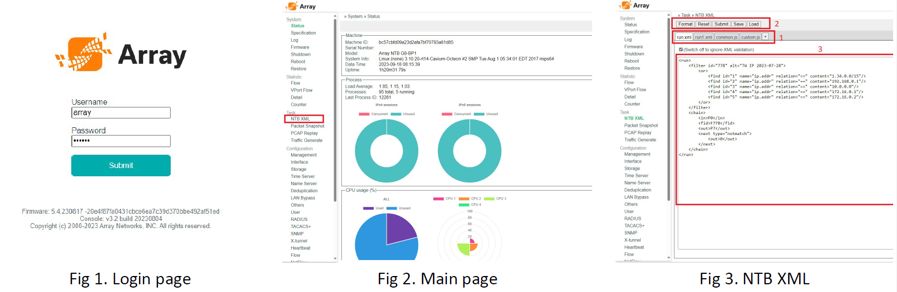

[PDF](https://drive.google.com/file/d/16-dVTgGlZkjnB4RLrFO5NnfL79nLZeYo/view?usp=sharing)
<center><font size="5"><strong>Table of Content</strong></font></center>


[TOC]


# Introduction

In today's rapidly evolving landscape of network management and security, the Network Traffic Broker (NTB) stands out as a pivotal tool, transforming the way organizations modify their existing networks to incorporate NTB and enhance security systems. SSL inspection, a crucial process for decrypting and inspecting secure traffic, and L2 bridging, a method for transparently passing traffic between network segments, have become indispensable components in today's complex network environments. NTB takes center stage by enabling devices like Intrusion Prevention Systems (IPS), Firewalls, Anti-Virus solutions, and more to seamlessly utilize SSL inspection and L2 bridging capabilities.

This strategic shift not only augments the overall flexibility of network configurations but also empowers organizations to efficiently integrate their existing equipment with new security functions. In this era of heightened cyber threats, mastering the implementation of NTB for SSL inspection and L2 bridge solutions is essential for network professionals seeking to fortify their network's resilience.

Transforming your existing network to incorporate the Network Traffic Broker (NTB) for SSL inspection and L2 bridge solutions is a multifaceted endeavor. In this training guide, we will delve into one of the primary methods of configuring NTB for existing networks and security systems: using the user-friendly Web GUI interface. While NTB can also be configured via the console interface, our focus will be on harnessing the web-based interface to effectively modify your network and integrate enhanced security measures. This guide aims to provide a step-by-step walkthrough, offering valuable insights into the process of configuring the NTB for SSL inspection and L2 bridge solutions through the web-based interface within the context of an existing network. By the end of this tutorial, you will have a solid foundation for seamlessly incorporating NTB into your network infrastructure, thus ensuring efficient SSL inspection and L2 bridging with ease.


# Web UI

To access the Web UI of any NTB model, you can connect to the MGMT port. The default IP address for the NTB is set to 192.168.1.150. When initially accessing the Web UI, you can utilize the default login credentials, where the username is "array," and the password is "admin," as illustrated in Figure 1. Once logged in, you will gain entry to the main page (depicted in Figure 2). From this main page, navigate to the "NTB XML" tab. This section allows users to harness the full capabilities of the NTB by utilizing XML tags for configuration and management.  

<center></center>
In this training document, once you access the NTB XML interface, you will encounter file tabs, file action buttons, and file edit windows, as illustrated in Figure 3. Let's explore the functions of each element in detail :

1. ***File Tabs:*** The file tabs display the available files for configuring NTB data task rules. Currently, the system supports two types of files: JavaScript and XML. The active file's tab will be highlighted in white, while the inactive ones will appear in gray. You can also make modifications to the content of these files through the file edit windows . 

2. ***File Action Buttons:*** There are five types of action buttons: "Format," "Reset," "Submit," "Save," and "Load."

   * The "Format" button checks whether the current active file complies with the proper XML format.
   * Clicking "Reset" reverts the current active file to its last submitted state, discarding any unsaved changes.
   * The "Submit" button for JavaScript files saves the current status of the JavaScript file. However, when dealing with XML files, clicking "Submit" will adjust the NTB's settings accordingly.
   * The "Save" and "Load" buttons are used for saving and loading the current XML file to and from disk space. 
  
3. ***File Edit Windows:*** This window is designed for modifying the content of XML or JavaScript files. It's worth noting that its capabilities are somewhat rudimentary, making it less suitable for editing large volumes of content. For more extensive edits, it's recommended to use external software and subsequently copy-paste the revised content into this window for submission .   


# XML Element

 The NTB utilizes XML scripts to establish control over data flow and perform packet engineering. XML files employ various elements to achieve distinct effects on the NTB. A comprehensive list of all XML elements can be found on the website [https://arraynetworks.gitbook.io/array-xml/](https://arraynetworks.gitbook.io/array-xml/). In this training document, we will specifically introduce the elements that will be utilized.


1. ***Element <run>:*** This should be the first element and encapsulate the entire document. Only elements inside the <run> element will be considered legal use of the XML elements.

2. ***Element <filter>:*** This element defines the filter rules to be employed in the XML script. Within this element, you have the option to assign attributes such as 'id' and 'name' to identify the filter for future reference. Additionally, other attributes like 'sessionBase' and 'matchedlog' can be used to control the filter's behavior. Furthermore, there are three types of elements available to establish filter rules: <find>, <and>, and <or>.  

   * Element <find>: This element defines the attribute used to distinguish the desired packet from the rest. Available attributes for selection include, but are not limited to, vlan.id, ip.addr, tcp.port, and more.
   * Elements <and> and <or>: These two elements define the relationships between different <find> elements. When various <find> elements are enclosed within <or> </or> tags, it will only be necessary to satisfy one condition. In contrast, for <and> </and>, it will be necessary to satisfy all find conditions.  
  
3. Element <output>: This element defines various actions and packet manipulations that can be performed when an internet packet exits a port. By using the <port> element to specify the exit port, you can then utilize various elements for packet engineering, such as <strip> to remove packet information, <Q> to add VLAN ID, and many other tags.  

4. Element <chain>: This element serves to consolidate all the elements together. It utilizes the <in> element to specify the input port, <fid> to identify the filter used, <next> element is used to specify the path a packet is going to take after being filtered, and <out> elements to define the output port and any actions to be taken at the output.

For comprehensive documentation and detailed guidance on how to utilize each element, as well as explore all available attributes, please refer to [https://arraynetworks.gitbook.io/array-xml/](https://arraynetworks.gitbook.io/array-xml/).


# Training Case
## Case A
<center></center>

In this training document, the current network layout, as depicted in Figure 4, features a switch, router, firewall, and DDoS protection. We are now introducing new elements, namely an APV and a security device, with the guidance of NTB. The process of integrating or adapting the existing layout to accommodate these new security devices can be complex, potentially requiring the deployment of multiple sets of security devices. This redundancy can lead to unnecessary duplication and inefficiencies within the network.

With the assistance of NTB, the process of integrating the new security devices can become more flexible, minimizing unused capacity and streamlining the network topology. Furthermore, NTB's capability to generate NetFlow data can enhance network monitoring and analysis, providing valuable insights into traffic flows and facilitating more effective network management.

<center></center>

In Case A, our objective is to integrate a new security device into the existing network, utilizing the APV for SSL interception for this newly introduced device, as shown in Figure 5. In this particular case, there are two distinct pathways, A and B, each providing a separate route to the web service. Both pathways share a single APV and a single NTB. The role of the NTB is to exclusively redirect traffic to and from TCP port 443 to the APV, allowing other data to pass through directly, thereby reducing the load on the APV's capacity.

For Path A, the data traffic enters at port 7, exits at port 5 to enter the APV, undergoes inspection by the security device, re-enters the NTB at port 4, and then leaves via port 6 towards the web server.

In Path B, the route involves entry at port 3, exiting at port 0 toward the APV, returning to the NTB from the APV at port 1, and leaving through port 2 towards the web server. Simultaneously, the NTB is capable of generating NetFlow data for both Path A and Path B, facilitating in-depth traffic analysis.

* Traffic to/from TCP port 443 requires SSL interception
* Path A traffic entering through Port 7 exits via Port 5 to the APV, re-enters through Port 4, and leaves at Port 6 vice versa.
* Path B traffic entering through Port 3 exits via Port 0 to the APV, re-enters through Port 1, and leaves at Port 2 vice versa.

### Case A Develop filter

Base on above criteria we are create the following <filter> element :

``````XML   
<!-- Filter Rules -->
    <!-- for 443 traffic -->
    <filter id="1" name="443/tcp, bidirection"  sessionBase="no">
        <or>
            <find name="tcp.port" relation="==" content="443"/>
        </or>
    </filter>
``````

<div style="page-break-before:always"></div>
### Case A Apply Chain Element from client to internet

<center></center>

After the <filter>  element was created, we will start create <chain> element from client to internet.  

``````XML
<!-- Packet flow Chain -->
    <!-- Path A -->
    <chain id="1">
        <in>P7</in>
        <fid>F1</fid>
        <out>P5</out>
        <next type="notmatch">
            <out>P6</out>
        </next>
    </chain>
    <chain id="2">
        <in>P4</in>
        <out>P6</out>
    </chain>
   <!-- Path B -->
    <chain id="5">
        <in>P3</in>
        <fid>F1</fid>
        <out>P0</out>
        <next type="notmatch">
            <out>P2</out>
        </next>
    </chain>
    <chain id="6">
        <in>P1</in>
        <out>P2</out>
    </chain>

``````
<div style="page-break-before:always"></div>
### Case A Apply Chain Element from internet to client

<center></center>

Next, we will create the <chain> element for traffic from the internet to the client, as illustrated in Figure 8.

``````XML
<!-- Path A return packet-->
    <chain id="3">
        <in>P6</in>
        <fid>F1</fid>
        <out>P4</out>
        <next type="notmatch">
            <out>P7</out>
        </next>
    </chain>
    <chain id="4">
        <in>P5</in>
        <out>P7</out>
    </chain>
<!-- Path B return packet-->
    <chain id="7">
        <in>P2</in>
        <fid>F1</fid>
        <out>P1</out>
        <next type="notmatch">
            <out>P3</out>
        </next>
    </chain>
    <chain id="8">
        <in>P0</in>
        <out>P3</out>
    </chain>
``````

### Case A Complete Combine Script

The complete XML script .

``````XML
<run>
<!-- Filter Rules -->
    <!-- for 443 traffic -->
    <filter id="1" name="443/tcp, bidirection"  sessionBase="no">
        <or>
            <find name="tcp.port" relation="==" content="443"/>
        </or>
    </filter>

<!-- Packet flow Chain -->
    <!-- Path A -->
    <chain id="1">
        <in>P7</in>
        <fid>F1</fid>
        <out>P5</out>
        <next type="notmatch">
            <out>P6</out>
        </next>
    </chain>
    <chain id="2">
        <in>P4</in>
        <out>P6</out>
    </chain>
   <!-- Path B -->
    <chain id="5">
        <in>P3</in>
        <fid>F1</fid>
        <out>P0</out>
        <next type="notmatch">
            <out>P2</out>
        </next>
    </chain>
    <chain id="6">
        <in>P1</in>
        <out>P2</out>
    </chain>

 <!-- Path 2  forward-->
    <chain id="201" name="Path 2 forward client to Server side or SSLi Ingress">
           <in>P1</in>
            <fid>F10</fid>
            <out>O12</out>
            <next type="notmatch">
               <out>P6</out>
            </next>
    </chain>

<!-- Path A return packet-->
    <chain id="3">
        <in>P6</in>
        <fid>F1</fid>
        <out>P4</out>
        <next type="notmatch">
            <out>P7</out>
        </next>
    </chain>
    <chain id="4">
        <in>P5</in>
        <out>P7</out>
    </chain>
<!-- Path B return packet-->
    <chain id="7">
        <in>P2</in>
        <fid>F1</fid>
        <out>P1</out>
        <next type="notmatch">
            <out>P3</out>
        </next>
    </chain>
    <chain id="8">
        <in>P0</in>
        <out>P3</out>
    </chain>
</run>
``````
<div style="page-break-before:always"></div>

## Case B
<center></center>

In Case B, we are working with a network configuration that utilizes the Link Aggregation Control Protocol (LACP) with two ports, as depicted in Figure 9. The process of integrating SSL interception and a security device into this network can be complex. It may require the deployment of additional pairs of devices, potentially leading to an inefficient use of data processing capacity.

By harnessing the capabilities of the Network Traffic Device (NTB), we can design a network topology that provides ample capacity and includes hardware bypass mechanisms to mitigate potential security device malfunctions, which could otherwise disrupt network operations. This approach enhances both the efficiency and reliability of network traffic management, as illustrated in Figure 10.

<center></center>

In this setup, internet service remains available even if the security device experiences an outage. With the new topology depicted in Figure 10, the Network Traffic Broker (NTB) can integrate a security device configured to monitor the network's security via a heartbeat packet signal. When the security device in the network ceases to function, the NTB swiftly redirects network traffic away from the compromised security device, as illustrated in Figure 11.

<center></center>

Furthermore, with NTB's hardware bypass at ports 6 and 7, internet traffic can continue to flow even if the NTB itself is non-operational, as demonstrated in Figure 12.

<center></center>

As depicted in Figure 10, the redirection of network traffic from Port 3 and Port 7 is a crucial step in this configuration. Specifically, HTTPS traffic from both Port 3 and Port 7 is directed to Port 0, where it undergoes processing through the Application Delivery Controller (APV) and the security device. To ensure that the network operates as intended and the functionalities of the APV and security device remain consistent, continuous monitoring is essential. Therefore, a heartbeat packet is sent from Port 0 to Port 1, providing ongoing health checks.

Upon passing through the APV and security device, the traffic must be properly segmented, and the VLAN tag added at Port 7's exit from Port 0 must be removed. This process guarantees the appropriate routing and isolation of network traffic, maintaining the integrity of the network's operation and security measures.

* Traffic to/from TCP port 443 undergoes SSL interception.
* TCP port 443 traffic from Port 7 exits through Port 0 with the addition of a VLAN tag (10) and then reset traffic before leaving Port 6.
* TCP port 443 traffic from Port 3 exits through Port 2, and the resets traffic leaves through Port 6.
* Traffic from Port 1, tagged with VLAN 10, has its VLAN tag removed and exits through Port 6.
* Traffic from Port 1 without VLAN tag 10 exits through Port 2.
* A heartbeat signal is sent from Port 0 to Port 1 for continuous monitoring.
* TCP port 443 traffic from Port 6 exits through Port 1 with the addition of a VLAN tag (10), resets, and then leaves through Port 7.
* TCP port 443 traffic from Port 2 exits through Port 1, resets, and then leaves through Port 3.
* Traffic from Port 0, tagged with VLAN 10, has its VLAN tag removed and exits through Port 7.
* Traffic from Port 0 without VLAN tag 10 exits through Port 3.

### Case B Develop filter

Base on above criteria we are create the following <filter> and <output> element :

``````XML
<!-- Filter Rules -->
    <!-- for 443 traffic -->
    <filter id="1" name="443/tcp, bidirection"  sessionBase="no">
        <or>
           <find name="tcp.port" relation="!=" content="443"/>
        </or>
    </filter>

    <filter id="2" sessionBase="no">
        <or>
            <find name="heartbeat.target.miss.id" relation="==" content="1"/>
        </or>
    </filter>

    <filter id="3" name="Path 1 Vlan Tag 10" sessionBase="no">
        <or>
            <find name="vlan.id" relation="==" content="10"/>
        </or>
    </filter>

    <output id="1">
        <port>P0</port>
        <Q>10</Q>
    </output>

    <output id="2">
        <port>P6</port>
        <stripping>vlan</stripping>
    </output>

    <output id="3">
        <port>P1</port>
        <Q>10</Q>
    </output>

    <output id="4">
        <port>P7</port>
        <stripping>vlan</stripping>
    </output>
``````
<div style="page-break-before:always"></div>
### Case B Apply Chain Element from client to internet

<center></center>

After the <filter> and <output> element was created, we will start create <chain> element from client to internet as illustrate in figure 13.  

``````XML
<!-- Packet flow Chain -->
    <chain id="1">
        <in>P7</in>
        <fid>F1</fid>
        <out>P6</out>
        <next type="notmatch">
            <fid>F2</fid>
                <out>P6</out>
                <next type="notmatch">
                        <out>O1</out>
                </next>
        </next>
    </chain>

    <chain id="2">
        <in>P1</in>
        <fid>F3</fid>
        <out>O2</out>
        <next type="notmatch">
            <out>P2</out>
        </next>
    </chain>

     <chain id="3">
            <in>P3</in>
            <fid>F1</fid>
            <out>P2</out>
            <next type="notmatch">
                <fid>F2</fid>
                    <out>P2</out>
                    <next type="notmatch">
                            <out>P0</out>
                    </next>
            </next>
      </chain>
``````

<div style="page-break-before:always"></div>
### Case B Apply Chain Element from internet to client

<center></center>

Next, we will create the <chain> element for traffic from the internet to the client, as illustrated in Figure 14.

``````XML
<!-- return packet -->
    <chain id="4">
        <in>P6</in>
        <fid>F1</fid>
        <out>P7</out>
        <next type="notmatch">
            <fid>F2</fid>
            <out>P7</out>
            <next type="notmatch">
                <out>O3</out>
            </next>
        </next>
    </chain>

    <chain id="5">
          <in>P2</in>
          <fid>F1</fid>
          <out>P3</out>
          <next type="notmatch">
              <fid>F2</fid>
              <out>P3</out>
              <next type="notmatch">
                  <out>P1</out>
              </next>
           </next>
    </chain>    

    <chain id="6">
         <in>P0</in>
         <fid>F2</fid>
         <out>P3</out>    
        <next type="notmatch">
            <out>O4</out>
        </next>
    </chain>


``````

### Case B Complete Combine Script

The complete XML script .

``````XML
<?xml version="1.0" encoding="UTF-8"?>
<run>
<!-- Filter Rules -->
    <!-- for 443 traffic -->
    <filter id="1" name="443/tcp, bidirection"  sessionBase="no">
        <or>
            <find name="tcp.port" relation="!=" content="443"/>
        </or>
    </filter>

<filter id="2" sessionBase="no">
    <or>
        <find name="heartbeat.target.miss.id" relation="==" content="1"/>
    </or>
</filter>

<filter id="3" name="Path 1 Vlan Tag 10" sessionBase="no">
     <or>
        <find name="vlan.id" relation="==" content="10"/>
     </or>
</filter>

<output id="1">
    <port>P0</port>
    <Q>10</Q>
</output>

<output id="2">
    <port>P6</port>
    <stripping>vlan</stripping>
</output>

 <output id="3">
    <port>P1</port>
    <Q>10</Q>
</output>

<output id="4">
    <port>P7</port>
    <stripping>vlan</stripping>
</output>
<!-- Packet flow Chain -->
    <chain id="1">
        <in>P7</in>
        <fid>F1</fid>
        <out>P6</out>
        <next type="notmatch">
            <fid>F2</fid>
                <out>P6</out>
                <next type="notmatch">
                        <out>O1</out>
                </next>
        </next>
    </chain>

    <chain id="2">
        <in>P1</in>
        <fid>F3</fid>
        <out>O2</out>
        <next type="notmatch">
            <out>P2</out>
        </next>
    </chain>

     <chain id="3">
            <in>P3</in>
            <fid>F1</fid>
            <out>P2</out>
            <next type="notmatch">
                <fid>F2</fid>
                    <out>P2</out>
                    <next type="notmatch">
                            <out>P0</out>
                    </next>
            </next>
      </chain>
<!-- return packet -->
    <chain id="4">
        <in>P6</in>
        <fid>F1</fid>
        <out>P7</out>
        <next type="notmatch">
            <fid>F2</fid>
            <out>P7</out>
            <next type="notmatch">
                <out>O3</out>
            </next>
        </next>
    </chain>

    <chain id="5">
          <in>P2</in>
          <fid>F1</fid>
          <out>P3</out>
          <next type="notmatch">
              <fid>F2</fid>
              <out>P3</out>
              <next type="notmatch">
                  <out>P1</out>
              </next>
           </next>
    </chain>    

    <chain id="6">
         <in>P0</in>
         <fid>F2</fid>
         <out>P3</out>    
        <next type="notmatch">
            <out>O4</out>
        </next>
    </chain>
</run>
``````