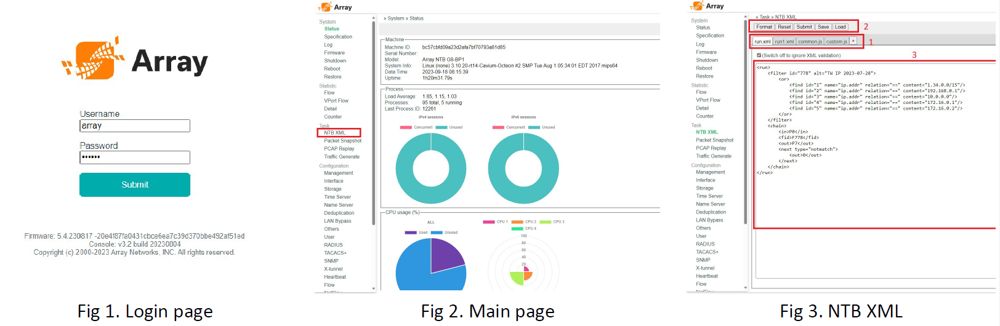
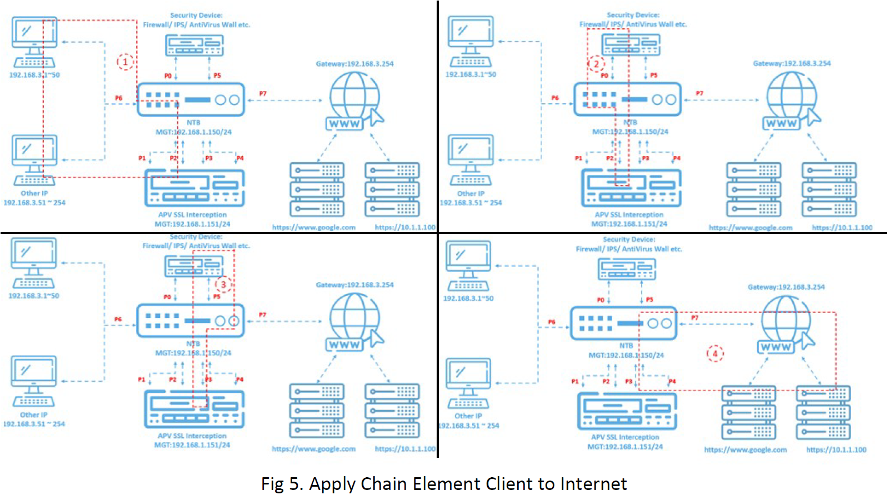
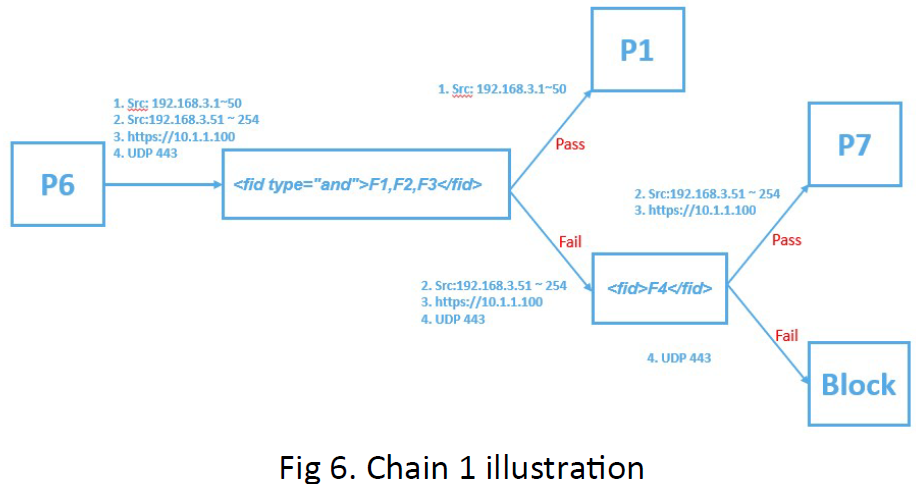
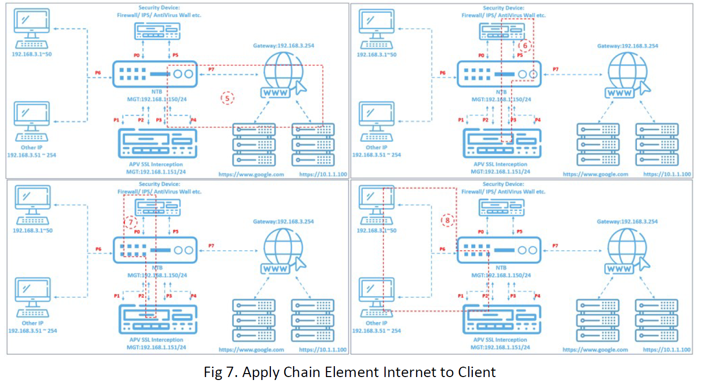
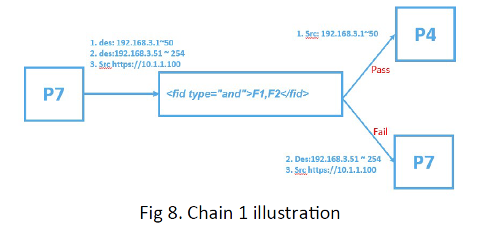
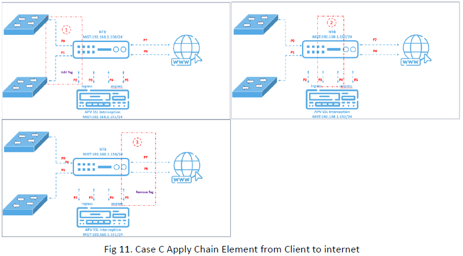
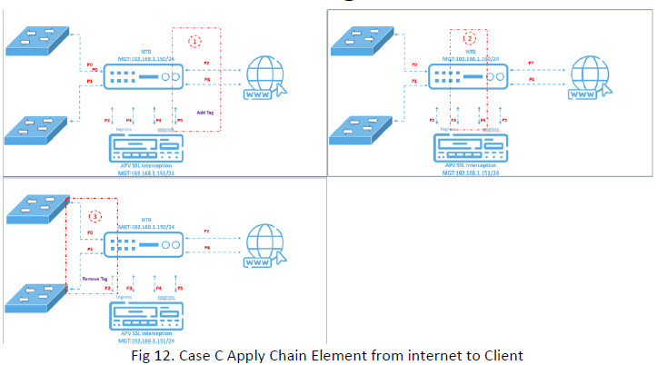

<center><font size="5"><strong>Table of Content</strong></font></center>


[TOC]


# Introduction

In the ever-evolving landscape of network management and security, the Network Traffic Broker (NTB) emerges as a valuable asset, reshaping the way organizations optimize their existing infrastructure. Function offloading, a process through which resource-intensive tasks are delegated to specialized devices, has become indispensable in today's complex network environments. NTB takes center stage by enabling devices like Intrusion Prevention Systems (IPS), Firewalls, Anti-Virus walls, and more to seamlessly offload tasks such as VLAN management, SSL interception, and GRE tunnel handling. This strategic shift not only enhances the overall agility of network configurations but also empowers organizations to efficiently integrate their existing equipment with new security functions. In this era of heightened cyber threats, understanding how to harness the potential of NTB for function offloading is essential for network professionals seeking to bolster their network's resilience.
Setting up the Network Traffic Broker (NTB) is a multi-faceted endeavor, and in this training guide, we will delve into one of the primary methods of configuration: the Web GUI interface. While the NTB can also be configured via the console interface, our focus will be on harnessing the user-friendly Web GUI to harness its capabilities for function offloading. This guide aims to provide a step-by-step walkthrough, offering valuable insights into the process of configuring the NTB for function offloading through the web-based interface. By the end of this tutorial, you will have a solid foundation for leveraging the NTB's potential, enabling you to streamline your network operations and ensure the efficient execution of resource-intensive tasks with ease.


# Web UI

To access the Web UI of any NTB model, you can connect to the MGMT port. The default IP address for the NTB is set to 192.168.1.150. When initially accessing the Web UI, you can utilize the default login credentials, where the username is "array," and the password is "admin," as illustrated in Figure 1. Once logged in, you will gain entry to the main page (depicted in Figure 2). From this main page, navigate to the "NTB XML" tab. This section allows users to harness the full capabilities of the NTB by utilizing XML tags for configuration and management.  

<center></center>
In this training document, once you access the NTB XML interface, you will encounter file tabs, file action buttons, and file edit windows, as illustrated in Figure 3. Let's explore the functions of each element in detail :

1. ***File Tabs:*** The file tabs display the available files for configuring NTB data task rules. Currently, the system supports two types of files: JavaScript and XML. The active file's tab will be highlighted in white, while the inactive ones will appear in gray. You can also make modifications to the content of these files through the file edit windows . 

2. ***File Action Buttons:*** There are five types of action buttons: "Format," "Reset," "Submit," "Save," and "Load."

   * The "Format" button checks whether the current active file complies with the proper XML format.
   * Clicking "Reset" reverts the current active file to its last submitted state, discarding any unsaved changes.
   * The "Submit" button for JavaScript files saves the current status of the JavaScript file. However, when dealing with XML files, clicking "Submit" will adjust the NTB's settings accordingly.
   * The "Save" and "Load" buttons are used for saving and loading the current XML file to and from disk space. 
  
3. ***File Edit Windows:*** This window is designed for modifying the content of XML or JavaScript files. It's worth noting that its capabilities are somewhat rudimentary, making it less suitable for editing large volumes of content. For more extensive edits, it's recommended to use external software and subsequently copy-paste the revised content into this window for submission .   


# XML Element

 The NTB utilizes XML scripts to establish control over data flow and perform packet engineering. XML files employ various elements to achieve distinct effects on the NTB. A comprehensive list of all XML elements can be found on the website [https://arraynetworks.gitbook.io/array-xml/](https://arraynetworks.gitbook.io/array-xml/). In this training document, we will specifically introduce the elements that will be utilized.


1. ***Element <run>:*** This should be the first element and encapsulate the entire document. Only elements inside the <run> element will be considered legal use of the XML elements.

2. ***Element <filter>:*** This element defines the filter rules to be employed in the XML script. Within this element, you have the option to assign attributes such as 'id' and 'name' to identify the filter for future reference. Additionally, other attributes like 'sessionBase' and 'matchedlog' can be used to control the filter's behavior. Furthermore, there are three types of elements available to establish filter rules: <find>, <and>, and <or>.  

   * Element <find>: This element defines the attribute used to distinguish the desired packet from the rest. Available attributes for selection include, but are not limited to, vlan.id, ip.addr, tcp.port, and more.
   * Elements <and> and <or>: These two elements define the relationships between different <find> elements. When various <find> elements are enclosed within <or> </or> tags, it will only be necessary to satisfy one condition. In contrast, for <and> </and>, it will be necessary to satisfy all find conditions.  
  
3. Element <output>: This element defines various actions and packet manipulations that can be performed when an internet packet exits a port. By using the <port> element to specify the exit port, you can then utilize various elements for packet engineering, such as <strip> to remove packet information, <Q> to add VLAN ID, and many other tags.  

4. Element <chain>: This element serves to consolidate all the elements together. It utilizes the <in> element to specify the input port, <fid> to identify the filter used, <next> element is used to specify the path a packet is going to take after being filtered, and <out> elements to define the output port and any actions to be taken at the output.

For comprehensive documentation and detailed guidance on how to utilize each element, as well as explore all available attributes, please refer to [https://arraynetworks.gitbook.io/array-xml/](https://arraynetworks.gitbook.io/array-xml/).


# Training Case

## Case A

<center></center>

One of the many functions of NTB is to perform function offloading. The key advantages of function offloading include enhancing network arrangement flexibility and improving the security and performance of existing hardware. In some cases, existing network equipment may lack support for certain security functions, such as SSL interception (SSLi), or implementing these functions may reduce the overall capability of the equipment. By employing function offloading, new security functions can be applied to existing equipment without incurring any performance penalties. 

This training encompasses three distinct training cases that demonstrate SSL interception (SSLi) offloading based on IP destination, handling VLAN scenarios, and utilizing VLANs to manipulate data flow.


In Case A, an application is deployed with APV in L2 Bridge transparent mode. In this scenario, NTB is required to redirect traffic for decryption and bypass based on both IP source and destination. Additionally, all non-SSL-intercepted (SSLi) internet traffic must be bypassed.  Below is the bypass and block traffic condition:

* Traffic with source  IP 192.168.3.1 ~ 50  need to be decrypt
* Traffic with source IP 192.168.3.51 ~ 254  need to be bypass
* Traffic with destination IP 10.1.1.10 need to bypass
* Traffic to/from UDP 443 Port need to be block

To develop an XML file, it can be beneficial to break down the process into four distinct steps. Begin by creating XML code for the <filter> element, specifying the required conditions, and configuring the <output> element for packet engineering at the output. Following this, combine the <filter> and <output> elements within the <chain> element to manage traffic from the client to the internet. Then, perform a similar combination for traffic from the internet to the client within the same <chain> element. Finally, consolidate all these XML components to create a comprehensive and functional script.

<div style="page-break-before:always"></div>
### Case A Develop filter

With all four packet traffic conditions, three filters will be developed. 
* Traffic with source  IP 192.168.3.1 ~ 50  need to be decrypt 
* Traffic with source IP 192.168.3.51 ~ 254  need to be bypass
* Traffic with destination IP 10.1.1.10 need to bypass
* Traffic to/from UDP 443 Port need to be block

This is because all clients have IP addresses ranging from 192.168.3.1 to 192.168.3.254. Therefore, after filtering out IP addresses from 192.168.3.1 to 192.168.3.50, the remaining clients fall within the IP range of 192.168.3.51 to 192.168.3.254 

For 'Traffic with source IP 192.168.3.1 to 192.168.3.50,' the first filter is created with the ID assigned as 1. This filter is not based on sessions, and the 'sessionBase' attribute is set to 'no.' In the <find> element, we aim to locate IP addresses ranging from 192.168.3.1 to 192.168.3.50. To achieve this, we specify 'ip.address' in the <find> name attribute (as this filter will be used for both traffic from the client to the internet and from the internet to the client, 'ip.address' is used instead of 'ip.src'). The 'relation' attribute is set to '==' and the 'content' attribute is set to '192.168.3.1-50.' The complete filter XML is displayed below:  

``````XML
         <filter id="1" name="src ip" sessionBase="no">
              <or>
                 <find name="ip.address" relation= "==" content= "192.168.3.1-50"/>
             </or>
          </filter>
```````

For 'Traffic with destination IP 10.1.1.10,' we assign ID 2 to the filter, and the 'sessionBase' attribute is set to 'no.' In the <find> element, the name attribute is 'ip.address,' the relation attribute is set to '!=' and the content attribute is set to '10.1.1.10.' .

``````XML
         <filter id="2" name="dst ip" sessionBase="no">
              <or>
                 <find name="ip.address" relation="!=" content="10.1.1.10"/>
             </or>
          </filter>
```````
For 'Traffic to/from UDP 443,' we assign ID 3 to the filter, and the 'sessionBase' attribute is set to 'no.' In the <find> element, the name attribute is 'udp.port,' the relation attribute is set to '!=' and the content attribute is set to '443.' .

 ``````XML
         <filter id="3" name="udp port 443 " sessionBase="no">
              <or>
                 <find name="udp.port" relation="!=" content="443"/>
             </or>
          </filter>
```````

<div style="page-break-before:always"></div>
<center></center>
### Case A Chain element from Client to internet 

With the filters now completed, we can proceed to use the <chain> element to combine the input port, output port, and filters, effectively constructing it into a task.

First, we will create the <chain> element for traffic from the client to the internet, as depicted in Figure 5. Chain 1 extends from port 6 to port 1 or to port 7 for bypass. To achieve this, we select port 6 as the input port and use the <and> element to combine filters 1, 2, and 3. Packets that meet the criteria of filters 1, 2, and 3 will be forwarded to port 1. Meanwhile, the remaining packets, which bypass the APV, will be directed to port 7 after filtering out those pertaining to UDP 443, which should be blocked .

``````XML

<chain id="1" name="1">
      <in>P6</in>
	<fid type="and">F1,F2,F3</fid>
              <out>P1</out>
       <next type="notmatch"> 
           <fid>F3</fid>
               <out>P7</out>
      </next>
</chain> 

``````
<center></center>

<div style="page-break-before:always"></div>
Chain 2 simply directs traffic from port 2 to port 0, while chain 3 directs traffic from port 5 to port 2, and chain 4 directs traffic from port 4 to port 7.

``````XML
    <chain id="2" name="2">
       <in>P2</in>
       <out>P0</out>
    </chain>

    <chain id="3" name="3">
        <in>P5</in>
        <out>P2</out>
    </chain>

    <chain id="4" name="4">
        <in>P4</in>
        <out>P7</out>
    </chain>
``````

### Case A Chain element from internet to Client


<center></center>


After establishing the client-to-internet connection, we must establish a reverse chain from the internet back to the client, starting with Chain 5 as illustrate Fig7 . This chain filters traffic, distinguishing packets requiring SSL interception from those that should bypass it, specifically for IP addresses in the range 192.168.3.1 to 192.168.3.50, excluding IP 10.1.1.10. Filter Chains 1 and 2 will be used, directing traffic to Port 7. Successfully filtered traffic goes to Port 4 for SSL interception, while others go to Port 6 for bypassing SSL interception.  


``````XML
    <chain id="5" name="5">
        <in>P7</in>
        <fid type="and">F1,F2</fid>
        <out>P4</out>
        <next type="notmatch">
            <out>P6</out>
        </next>
    </chain> 
``````
<center></center>

Chain 6 simply directs traffic from port 5 to port 3, while chain 7 directs traffic from port 2 to port 0, and chain 8 directs traffic from port 1 to port 6. 


``````XML
      <chain id="6" name="6">
            <in>P5</in>
            <out>P3</out>
      </chain>
      
      <chain id="7" name="7">
             <in>P2</in>
             <out>P0</out>
      </chain>
               
      <chain id="8" name="8">
            <in>P1</in>
            <out>P6</out>
      </chain>
``````
### Case A Complete Combine Script

Finally after all the partial scripts are complete we can combine it into complete script and post it into the WebGUI

``````XML
<run> 
<!-- ####  Filter Rules  ####  -->
    <!-- Find client IP which need to SSLi -->
         <filter id="1" name="src ip" sessionBase="no">
              <or>
                 <find name="ip.address" relation="==" content="192.168.3.1-50"/>
             </or>
          </filter>

         <filter id="2" name="dst ip" sessionBase="no">
              <or>
                 <find name="ip.address" relation="!=" content="10.1.1.10"/>
             </or>
          </filter>

         <filter id="3" name="udp port 443" sessionBase="no">
              <or>
                 <find name="udp.port" relation="!=" content="443"/>
             </or>
          </filter>

         <chain id="1" name="1">
           <in>P6</in>
           <fid type="and">F1,F2,F3</fid>
           <out>P1</out>
           <next type="notmatch"> 
                <fid>F3</fid>
                <out>P7</out>
           </next>
         </chain> 
         
         <chain id="2" name="2">
               <in>P2</in>
               <out>P0</out>
         </chain>
         
         <chain id="3" name="3">
                <in>P5</in>
                <out>P2</out>
          </chain>
          
          <chain id="4" name="4">
                <in>P4</in>
                <out>P7</out>
          </chain>
           
          <chain id="5" name="5">
              <in>P7</in>
              <fid type="and">F1,F2</fid>
              <out>P4</out>
              <next type="notmatch">
                  <out>P6</out>
              </next>
           </chain> 
           
           <chain id="6" name="6">
                    <in>P5</in>
                    <out>P3</out>
           </chain>
           
           <chain id="7" name="7">
                    <in>P2</in>
                    <out>P0</out>
           </chain>
           
           <chain id="8" name="8">
                    <in>P1</in>
                    <out>P6</out>
           </chain>
</run>
``````
<div style="page-break-before:always"></div>

## Case B

<center></center>

In Case B, the scenario closely resembles Case A, with the additional condition that clients with IP addresses ranging from 192.168.3.1 to 192.168.3.50 are on VLAN 100, while the remaining clients are on different VLANs. In addition to the conditions from the previous scenario, NTB is now required to perform an additional task: removing the VLAN tag before the traffic enters the APV for SSL interception and adding the VLAN tag back after the APV completes the SSL interception process:

* Traffic with  source  IP 192.168.3.1 ~ 50 (vlan 100 ) need to be decrypt 
* Traffic with source IP 192.168.3.51 ~ 254  need to be bypass
* Traffic with destination IP 10.1.1.10 need to bypass
* Traffic to/from UDP 443 Port need to be block

### Case B Develop filter

While the filter development remains consistent with that of Case A, a new task has been introduced: re-moving the VLAN tag upon entry and then re-adding it as the packet exits port 7. To accomplish this, we make use of the <output> element, which provides us with the ability to both strip and add VLAN tags as needed. In this context, the VLAN tag is removed at port 1 and reinstated at port 7. Furthermore, in the direction from the internet to the client, port 4 is responsible for stripping the VLAN tag, while port 6 is tasked with adding the VLAN tag.

``````XML
<!-- remove tag , traffic forward to APV -->
<output id="1">
        <port>P1</port>
        <stripping>vlan</stripping>    
</output>
<!-- add tag , traffic forward to internet -->
<output id="2">
    <port>P7</port>
    <Q>100</Q>
</output> 

<!-- Remove tag , traffic forward to internet -->
<output id="3">
    <port>P4</port>
    <stripping>vlan</stripping>
</output>

<!-- add tag , traffic forward to internet -->
<output id="4">
    <port>P6</port>
    <Q>100</Q>
</output>

``````

### Case B Chain element 

The chain arrangement will closely resemble that of Case A, with the exception of chains 1, 4, 5, and 8, which will require modification of the existing <out> elements with the new <output> element.

``````XML
<chain id="1" name="1">
   <in>P6</in>
   <fid type="and">F1,F2,F3</fid>
   <out>O1</out>
      <next type="notmatch"> 
           <fid>F3</fid>
               <out>P7</out>
      </next>
</chain> 

<chain id="4" name="4">
        <in>P4</in>
        <out>O2</out>
</chain>

<chain id="5" name="5">
     <in>P7</in>
     <fid type="and">F1,F2</fid>
     <out>O3</out>
     <next type="notmatch">
         <out>P6</out>
     </next>
</chain> 

<chain id="8" name="8">
      <in>P1</in>
      <out>O4</out>
</chain>
``````

### Case B Complete Combine Script

After implementing these changes, we can consolidate all the scripts into a complete script as follows: 

``````XML
<run> 
<!-- ####  Filter Rules  ####  -->
    <!-- Find client IP which need to SSLi -->
         <filter id="1" name="src ip" sessionBase="no">
              <or>
                 <find name="ip.address" relation= "==" content="192.168.3.1-50"/>
             </or>
          </filter>
         <filter id="2" name="dst ip" sessionBase="no">
              <or>
                 <find name="ip.address" relation="!=" content="10.1.1.10"/>
             </or>
          </filter>
         <filter id="3" name="udp port 443 " sessionBase="no">
              <or>
                 <find name="udp.port" relation="!=" content="443"/>
             </or>
          </filter>
          <output id="1">
              <port>P1</port>
              <stripping>vlan</stripping>    
          </output>
          <output id="2">
               <port>P7</port>
               <Q>100</Q>
          </output> 
         <output id="3">
              <port>P4</port>
              <stripping>vlan</stripping>
         </output>
         
         <output id="4">
              <port>P6</port>
              <Q>100</Q>
         </output>

         <chain id="1" name="1">
             <in>P6</in>
             <fid type="and">F1,F2,F3</fid>
             <out>O1</out>
                 <next type="notmatch"> 
                    <fid>F3</fid>
                        <out>P7</out>
                 </next>
         </chain> 

         <chain id="2" name="2">
               <in>P2</in>
               <out>P0</out>
         </chain>
          
          <chain id="3" name="3">
                <in>P5</in>
                <out>P2</out>
          </chain>
          
          <chain id="4" name="4">
                <in>P4</in>
                <out>O2</out>
          </chain>        
          
          <chain id="5" name="5">
               <in>P7</in>
               <fid type="and">F1,F2</fid>
                <out>O3</out>
               < next type="notmatch">
                    <out>P6</out>
                </next>
           </chain> 
            
           <chain id="6" name="6">
                    <in>P5</in>
                    <out>P3</out>
           </chain>
            
           <chain id="7" name="7">
                    <in>P2</in>
                    <out>P0</out>
            </chain>
            
            <chain id="8" name="8">
                    <in>P1</in>
                    <out>O4</out>
            </chain>
</run>
``````

<div style="page-break-before:always"></div>
## Case C

<center></center>

In Case C, our objective is to offload SSL interception for multiple links, as depicted in Figure 8. To initiate this process, we must capture all HTTPS traffic, achieved by filtering all traffic destined for TCP port 443. It's important to note that this traffic can originate from either port 0 or port 1. After undergoing SSL interception, it's crucial to keep these traffic streams separate. Traffic from port 0 should exit via port 7, while traffic from port 1 should exit through port 6. To achieve this separation, we add a VLAN 100 tag to all traffic from port 0 before SSL interception, and remove it afterward. Similarly, for port 1 traffic, we use a VLAN 200 tag. These VLAN tags enable us to employ filters for the separation of port 0 and port 1 traffic.

* Traffic to/from TCP port 443 requires SSL interception
* For traffic entering through Port 0, it should exit through Port 7, and vice versa
* For traffic entering through Port 1, it should exit through Port 6, and vice versa

### Case C Develop filter

Base on above criteria we are create the following <filter> and <output> element :

``````XML
<!--  to catch destination port 443 from forward packet -->     
<filter id="10" name="forward to SSLi for specific port" sessionBase="no">
        <or>
            <find name="tcp.dstport" relation="==" content="443"/>
        </or>
    </filter>

<!--  to catch source port 443 from return packet -->
<filter id="11" name="return to SSLi for specific port" sessionBase="no">
      <or>
          <find name="tcp.srcport" relation="==" content="443"/>
      </or>
</filter>
<!--  to catch vlan ID for return to source/destination physical port -->
<!--  path 1: vlan 100 , path 2: vlan 200 -->
<filter id="12" name="Path 1 Vlan Tag 100" sessionBase="no">
     <or>
        <find name="vlan.id" relation="==" content="100"/>
     </or>
</filter>

<!-- Add Tag-->
<output id="11">
        <port>P2</port>
        <Q>100</Q>
    </output>
 <output id="12">
        <port>P2</port>
        <Q>200</Q>
    </output>
<output id="21">
        <port>P5</port>
        <Q>100</Q>
 </output>
<output id="22">
        <port>P5</port>
        <Q>200</Q>
 </output>

<!-- Remove Tage -->
<output id="31">
        <port>P7</port>
        <stripping>vlan</stripping>
    </output>
 <output id="32">
        <port>P6</port>
        <stripping>vlan</stripping>
    </output>
</output>
    <output id="41">
        <port>P0</port>
        <stripping>vlan</stripping>
    </output>
    <output id="42">
        <port>P1</port>
        <stripping>vlan</stripping>
    </output>

``````
<div style="page-break-before:always"></div>
### Case C Apply Chain Element from client to internet

<center></center>

After the <filter> and <output> element was created, we will start create <chain> element from client to internet.  

``````XML
<!-- Path 1  forward-->
<chain id="101" name="forward client to Server side or SSLi Ingress">
      <in>P0</in>
      <fid>F10</fid>
      <out>O11</out>
      <next type="notmatch">
          <out>P7</out>
      </next>
</chain> 
<chain id="102">
        <in>P3</in>
        <out>P4</out>
</chain>
<chain id="103">
        <in>P5</in>
        <fid>F12</fid>
        <out>O31</out>
        <next type="notmatch">
            <out>O32</out>
        </next>
</chain>
 <!-- Path 2  forward-->
<chain id="201" name="Path 2 forward client to Server side or SSLi Ingress">
        <in>P1</in>
        <fid>F10</fid>
        <out>O12</out>
        <next type="notmatch">
            <out>P6</out>
        </next>
</chain>

``````
<div style="page-break-before:always"></div>
### Case C Apply Chain Element from internet to client

<center></center>

Next, we will create the <chain> element for traffic from the internet to the client, as illustrated in Figure 12.

``````XML
<!-- Path 1 return-->
<chain id="501">
    <in>P7</in>
    <fid>F11</fid>
    <out>O21</out>
    <next type="notmatch">
        <out>P0</out>
    </next>
</chain>
 <chain id="502">
        <in>P4</in>
        <out>P3</out>
</chain>
 <chain id="503">
    <in>P2</in>
    <fid>F12</fid>
    <out>O41</out>
    <next type="notmatch">
        <out>O42</out>
    </next>
</chain>
<!-- Path 2 return-->
<chain id="601">
     <in>P6</in>
    <fid>F11</fid>
    <out>O22</out>
    <next type="notmatch">
        <out>P1</out>
    </next>
</chain>

``````

### Case C Complete Combine Script

The complete XML script .

``````XML
<run>
<!--  to catch destination port 443 from forward packet -->     
    <filter id="10" name="forward to SSLi for specific port" sessionBase="no">
        <or>
            <find name="tcp.dstport" relation="==" content="443"/>
        </or>
    </filter>
<!--  to catch source port 443 from return packet -->
    <filter id="11" name="return to SSLi for specific port" sessionBase="no">
      <or>
          <find name="tcp.srcport" relation="==" content="443"/>
      </or>
    </filter>
<!--  to catch vlan ID for return to source/destination physical port -->
<!--  path 1: vlan 100 , path 2: vlan 200 -->
    <filter id="12" name="Path 1 Vlan Tag 100" sessionBase="no">
         <or>
            <find name="vlan.id" relation="==" content="100"/>
         </or>
    </filter>
<!--  Add Tag-->
    <output id="11">
        <port>P2</port>
        <Q>100</Q>
    </output>

    <output id="12">
        <port>P2</port>
        <Q>200</Q>
    </output>

    <output id="21">
        <port>P5</port>
        <Q>100</Q>
    </output>

    <output id="22">
        <port>P5</port>
        <Q>200</Q>
     </output>

<!-- Remove Tage -->
    <output id="31">
        <port>P7</port>
        <stripping>vlan</stripping>
    </output>

    <output id="32">
        <port>P6</port>
        <stripping>vlan</stripping>
    </output>

    <output id="41">
        <port>P0</port>
        <stripping>vlan</stripping>
    </output>

    <output id="42">
        <port>P1</port>
        <stripping>vlan</stripping>
    </output>
<!-- Path 1  forward-->
    <chain id="101" name="forward client to Server side or SSLi Ingress">
         <in>P0</in>
         <fid>F10</fid>
         <out>O11</out>
         <next type="notmatch">
             <out>P7</out>
          </next>
    </chain> 
   <chain id="102">
        <in>P3</in>
        <out>P4</out>
   </chain>
    <chain id="103">
           <in>P5</in>
           <fid>F12</fid>
           <out>O31</out>
            <next type="notmatch">
               <out>O32</out>
            </next>
    </chain>
 <!-- Path 2  forward-->
    <chain id="201" name="Path 2 forward client to Server side or SSLi Ingress">
           <in>P1</in>
            <fid>F10</fid>
            <out>O12</out>
            <next type="notmatch">
               <out>P6</out>
            </next>
    </chain>

<!-- Path 1 return-->
    <chain id="501">
        <in>P7</in>
        <fid>F11</fid>
        <out>O21</out>
        <next type="notmatch">
           <out>P0</out>
        </next>
    </chain>
    <chain id="502">
        <in>P4</in>
        <out>P3</out>
    </chain>
    <chain id="503">
        <in>P2</in>
        <fid>F12</fid>
        <out>O41</out>
        <next type="notmatch">
            <out>O42</out>
        </next>
    </chain>
    <!-- Path 2 return-->
    <chain id="601">
         <in>P6</in>
        <fid>F11</fid>
        <out>O22</out>
        <next type="notmatch">
            <out>P1</out>
        </next>
     </chain>
</run>
``````